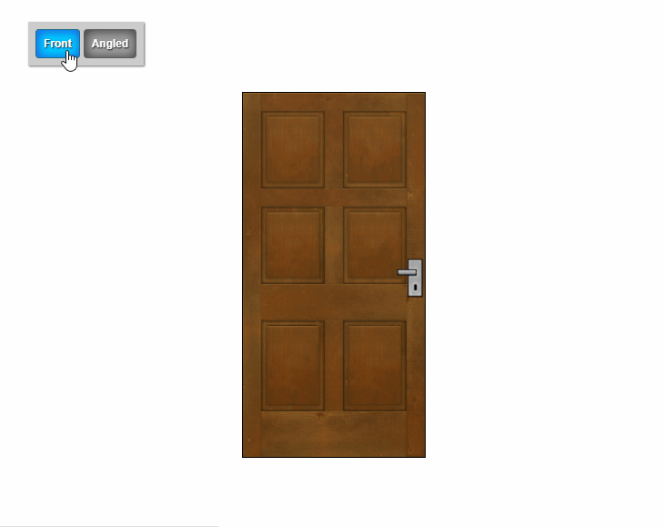
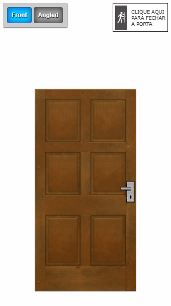

# Interactive Door

Este componente de porta interativa foi desenvolvido para explorar conceitos de CSS 3D, utilizando as propriedades de "transform" nos eixos Y e Z em conjunto com 
"perspective" para gerar profundidade. O efeito de movimento é aplicado através do rotateY no hover do elemento, e a representação permite visualizar o objeto sob dois ângulos diferentes de exibição.

## 📍 Live Demo
Veja o projeto no seu navegador:

<a href="https://dcastrodev.github.io/interactive-door/"><strong>🔗 Click to View</strong></a>

## Linguagens
- HTML5
- CSS3

## Layout Preview

### PC

 

### Mobile

